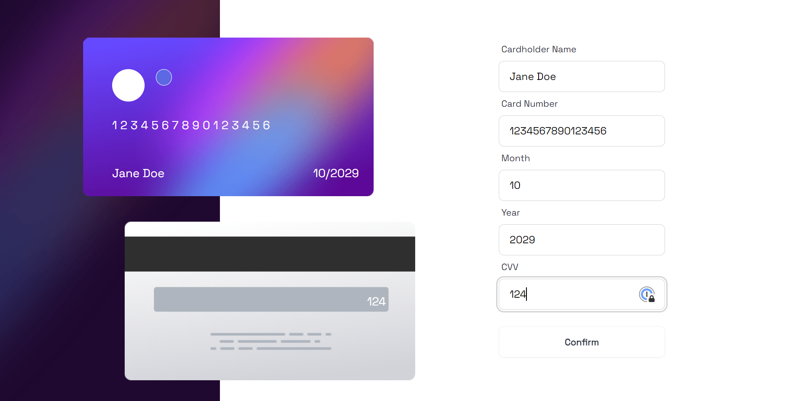
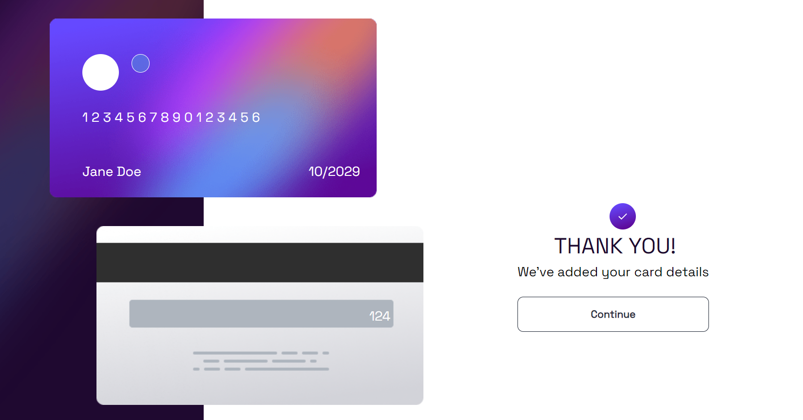

**Project Title: Interactive Card**

### Overview:

This React project provides a hands-on opportunity to apply React skills while mastering form validation techniques. I was able to deepen my understanding of state management, component composition, and event handling.

### Features:

1. **Form Validation:** Implement form validation logic using React's state and props to manage user input and feedback.
2. **Component Composition:** Break down the UI into reusable components, fostering code modularity and maintainability.
3. **State Management:** Utilize React state to store and update form data, ensuring seamless synchronization between components.
4. **Event Handling:** Handle user interactions and form submissions using React event handlers, facilitating dynamic updates and error handling.
5. **Conditional Rendering:** Employ conditional rendering techniques to display error messages and validation cues based on user input.
6. **CSS Styling:** Apply CSS styles to enhance the visual appeal and usability of the form, adhering to best practices in responsive design.

### Learning Outcomes:

I was able to practice a range of React skills, including:

1. **State and Props:** Proficiency in managing component state and passing data between parent and child components using props.
2. **Event Handling:** Handle user interactions such as form submissions, input changes, and button clicks using React event system.
3. **Conditional Rendering:** Conditionally rendering components and elements based on state and other conditions.
4. **Form Validation Techniques:** Explore various strategies for form validation within a React context, including input validation, error handling, and feedback mechanisms.
5. **Component Reusability:** Practice creating reusable components that can be easily integrated into different parts of the application, promoting code reusability and maintainability.

# Getting Started with Create React App

This project was bootstrapped with [Create React App](https://github.com/facebook/create-react-app).

## Available Scripts

In the project directory, you can run:

### `npm start`

Runs the app in the development mode.\
Open [http://localhost:3000](http://localhost:3000) to view it in your browser.

### `npm test`

Launches the test runner in the interactive watch mode.\
See the section about [running tests](https://facebook.github.io/create-react-app/docs/running-tests) for more information.

### `npm run build`

Builds the app for production to the `build` folder.\
It correctly bundles React in production mode and optimizes the build for the best performance.

The build is minified and the filenames include the hashes.\
Your app is ready to be deployed!
